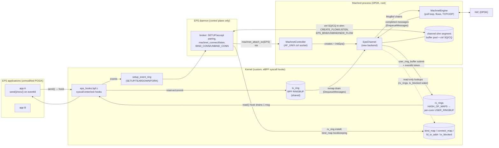
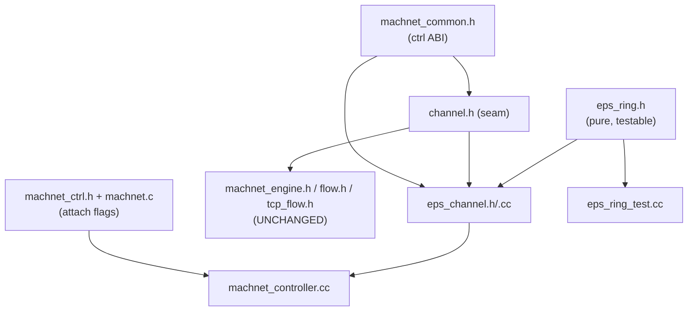
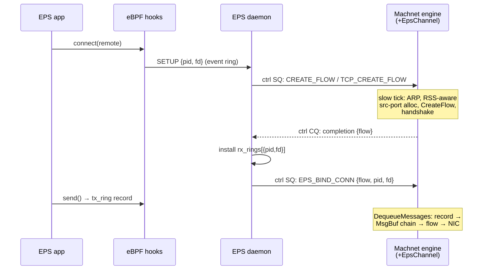
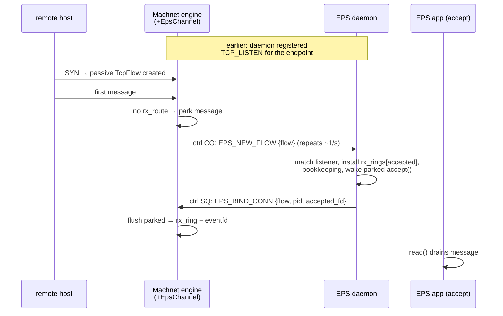
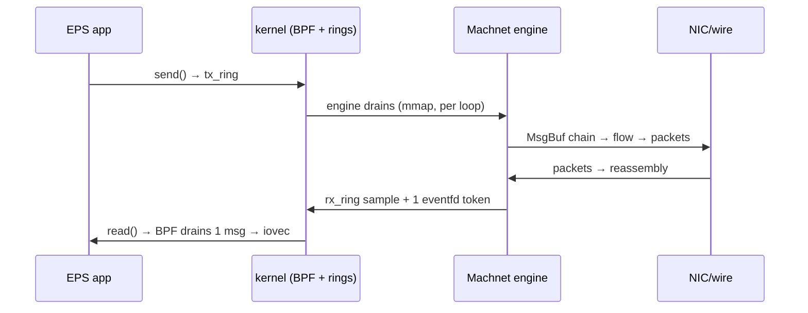

# EPS ↔ Machnet Integration — Engineering Design Document

**Status:** Implemented (Option B), pending Linux build + daemon-side changes
**Branch:** `eps-option-b` | **Companion doc:** [EPS.md](EPS.md) (operational contract)
**Scope:** How the Machnet engine was connected directly to the EPS eBPF
datapath, the module structure, the protocols, and the engineering process.

---

## 1. Executive summary

EPS ("Accelerated Networking") transparently intercepts POSIX socket syscalls
of unmodified applications with eBPF hooks and moves data through kernel ring
buffers. Machnet is a DPDK-based userspace network stack with shared-memory
channels. This work removed the userspace poller from the EPS data path by
teaching the Machnet engine to **drain the EPS `tx_ring` and deliver into
per-connection `rx_rings` directly** (“Option B”), after a poller-based bridge
(“Option A”) validated the end-to-end concept.

The integration required **zero changes to the Machnet engine core**. It was
achieved by (a) making three methods of the channel abstraction virtual — the
exact three points where the engine/flows touch a channel's message rings —
and (b) adding one new channel backend, `EpsChannel`, plus a small
daemon↔engine control protocol carried over the channel's existing ctrl rings.

```
Per-message path, before (Option A):        After (Option B):

app → BPF → tx_ring → poller →              app → BPF → tx_ring →
      machnet_sendmsg → shm ring →                Machnet engine → NIC
      Machnet engine → NIC

NIC → engine → shm ring → poller →          NIC → Machnet engine →
      rx_ring → BPF → app                         rx_ring → BPF → app
```

One process hop and one payload copy removed per direction; the EPS daemon
remains purely control-plane.

---

## 2. Background

### 2.1 The two systems

| | EPS | Machnet |
|---|---|---|
| App interface | unmodified POSIX (`socket/connect/send/recv`), intercepted by eBPF syscall hooks on a custom kernel | message API (`machnet_send/recv`) over a shm channel |
| Data carrier | kernel BPF ring buffers carrying **payload bytes** (`tx_ring` RINGBUF, per-conn `rx_rings` USER_RINGBUF) | shm rings carrying **buffer indices** into a shared pool (descriptor passing) |
| Wakeup | eventfd-semaphore per connection: 1 token = 1 message | polling |
| Identity | `conn_key {tgid, fd}` | flow 4-tuple `{src_ip, src_port, dst_ip, dst_port}` |

The structural mismatch (bytes-in-ring vs. indices-into-pool) means one copy
at the boundary is unavoidable; Option B places that copy inside the engine,
where it replaces (not adds to) the copy the app-facing shim used to do.

### 2.2 Options considered

- **Option A (done first, no Machnet changes):** the EPS poller acts as a
  Machnet application — drains `tx_ring` → `machnet_sendmsg()`;
  `machnet_recvmsg()` → writes `rx_rings` + eventfd. Validated the whole
  concept end-to-end at the cost of an extra process hop and copy.
- **Option B (this work):** the engine speaks the EPS rings natively; the
  poller's data path retires. The daemon keeps its Option A control role.

---

## 3. System architecture



Key structural facts:

- **The engine core is unchanged.** Its `Run()` loop still calls
  `channel->DequeueMessages(...)`; flows still call
  `channel_->EnqueueMessages(...)`; the slow tick still calls
  `channel->DequeueCtrlRequests(...)`. Virtual dispatch routes these to the
  EPS implementations when the channel is an `EpsChannel`.
- **The channel shm segment survives** as the engine's buffer pool (so
  DPDK/zero-copy DMA registration is untouched) and as the transport for the
  ctrl SQ/CQ; only the two *message* rings are bypassed.
- **All routing policy lives in the daemon**; `EpsChannel` is mechanism only
  and never writes EPS-owned BPF maps (`rx_rings`, `bind_map`,
  `connect_map`).

---

## 4. Module inventory

| Module | Location | Role | Depends on |
|---|---|---|---|
| EPS ABI + ring reader | `src/include/eps_ring.h` **(new)** | EPS struct layouts (`EpsConnKey`, `EpsTxEntry`, static-asserted) and `EpsTxRingReader`, the raw BPF-ringbuf consumer cursor. **Zero dependencies** — unit-testable anywhere. | libc only |
| EPS channel backend | `src/include/eps_channel.h`, `src/core/drivers/shm/eps_channel.cc` **(new)** | The `EpsChannel` class: TX intake, RX delivery, ctrl interception, connection cache, sweep, parked-sender wake. Compiled only when `MACHNET_EPS_ENABLED`. | `channel.h`, `eps_ring.h`, libbpf, glog |
| Channel abstraction (seam) | `src/include/channel.h` **(modified)** | `ShmChannel`/`Channel`/`ChannelManager`. Three methods made `virtual` + virtual dtor; `AddChannelOfType<C>()` factory template. | — |
| Controller | `src/core/machnet_controller.cc` **(modified)** | Creates an `EpsChannel` (and runs `InitEps()`) when the attach request carries `MACHNET_CHANNEL_INFO_FLAG_EPS`. | `eps_channel.h` |
| Shared ctrl ABI | `src/ext/machnet_common.h` **(modified)** | `MachnetEpsConnBind_t` + 3 EPS opcodes in `MachnetCtrlQueueEntry_t`. | — |
| Controller-socket ABI | `src/ext/machnet_ctrl.h` **(modified)** | `flags` field + `MACHNET_CHANNEL_INFO_FLAG_EPS` on `machnet_channel_info`. | — |
| App shim | `src/ext/machnet.c/.h` **(modified)** | `machnet_attach_ex(flags)`; `machnet_attach()` = `machnet_attach_ex(0)`. | — |
| Build | `src/CMakeLists.txt`, `src/core/CMakeLists.txt` **(modified)** | pkg-config `libbpf>=1.1` → `MACHNET_EPS_ENABLED` + PUBLIC link on `core`. Graceful degradation without libbpf. | — |
| Tests | `src/core/drivers/shm/eps_ring_test.cc` **(new)** | 8 gtest cases for the ring consumer protocol against synthetic memory. Auto-registers via the test glob. | gtest, glog |
| Docs | `docs/EPS.md` **(new)**, this file | Operational contract for the daemon; engineering design. | — |

Dependency direction (no cycles):



---

## 5. The virtual channel seam

### 5.1 Why these three methods

A recon pass over every use of `ShmChannel`/`Channel` in the tree showed the
engine and flows touch a channel's *message rings* at exactly three points:

| Seam | Call sites | Meaning |
|---|---|---|
| `EnqueueMessages(MsgBuf *const *, n)` | `flow.h:269` (UDP reassembly), `tcp_flow.h:785` (TCP deframer) | “deliver this completed message to the app” |
| `DequeueMessages(slots, msgs, n)` | engine `Run()` via the batch wrapper (`machnet_engine.h:447`) | “give me the app's outgoing messages” |
| `DequeueCtrlRequests(...)` | engine slow tick (`machnet_engine.h:660`) | control-plane poll — the hook point for intercepting EPS opcodes |

Everything else (`MsgBufAlloc`, headroom management, DMA registration,
listener/flow bookkeeping) is *shared machinery* that `EpsChannel` reuses
verbatim — deliberately non-virtual.

### 5.2 Placement and correctness constraints (discovered in recon)

- Virtuals had to go on **`ShmChannel`**, not `Channel`: tests/benches call
  through `ShmChannel*`; declaring on `Channel` would *hide*, not override.
- `ShmChannel` must stay **concrete** (bodies, not pure) —
  `ChannelManager<ShmChannel>` is instantiated by tests/benches.
- The batch wrapper `EnqueueMessages(MsgBufBatch*)` originally called the
  *indices* overload (non-virtual) — re-routed through the pointer overload
  so batch enqueues also dispatch virtually.
- No code does `sizeof`/`memcpy`/by-value storage of these classes, so adding
  a vtable is layout-safe; the shm layout lives in C structs
  (`MachnetChannelCtx_t`), untouched.
- `-fno-rtti` build: type recovery uses `std::static_pointer_cast` at the one
  site where the concrete type is statically known (controller).
- Cost: one indirect call per message *batch* on the hot path — noise
  relative to the payload memcpy.

### 5.3 Creation path

`ChannelManager::AddChannelOfType<C>(name, …, extra…)` generalizes the old
`AddChannel` body (`make_shared<T>` → `make_shared<C>` with forwarded extra
ctor args). `AddChannel` delegates to `AddChannelOfType<T>`, preserving
byte-for-byte behavior for every existing caller.

---

## 6. EpsChannel internals

### 6.1 State

| Structure | Key → Value | Written by | Purpose |
|---|---|---|---|
| `tx_flows_` | conn_key → `MachnetFlow_t` (TX orientation) | `BIND_CONN` | stamp outgoing `MsgBuf` chains so `process_msg` routes them |
| `rx_routes_` | delivery-orientation 4-tuple → conn_key | `BIND_CONN` (reversed) | route delivered messages to a connection |
| `rx_conns_` | conn_key → `{map_fd, user_ring_buffer*, wake_efd, inner_map_id}` | lazily on first delivery | cached ring + eventfd handles; identity-checked by inner map ID |
| `pending_rx_` | 4-tuple → parked `MsgBuf*` list + age | unroutable deliveries | bounded (256 msgs, ~8 s TTL) hold until BIND |
| `new_flow_posted_` | TX-orientation tuple → bool | NEW_FLOW dedup | re-armed each sweep while messages stay parked |
| `ctrl_out_queue_` | deque of CQ entries | completions + NEW_FLOW | the CQ ring is 2 slots; overflow retried each tick |
| `tx_reader_` | — | — | `EpsTxRingReader` cursor over the mmap'ed tx_ring |

conn_key is packed `(pid << 32) | fd`. All state is owned by the single
engine thread that serves the channel (libbpf's `user_ring_buffer` producer
API is not thread-safe — one engine per EPS channel is a hard requirement).

### 6.2 TX intake — `DequeueMessages` override

```
loop while batch has room:
  Peek tx_ring:
    empty/busy        → stop
    discard           → Advance, continue
    malformed record  → count, Advance, continue
    conn_key unbound  → stop WITHOUT Advance   (hold-slot backpressure,
                                                poller parity; head-of-line)
    pool exhausted    → stop WITHOUT Advance   (retry next engine loop)
    else: BuildMsgChain(payload, len, flow)    (SYN/SG/FIN/msg_len/last
                                                conventions identical to
                                                machnet_sendmsg)
          emit to batch, Advance
after loop: wake parked senders on drain-to-empty / every 64 records
```

Not advancing the consumer offset is the backpressure mechanism: the record
is re-presented on the next engine iteration, and conversion is idempotent.

### 6.3 RX delivery — `EnqueueMessages` override

```
for each delivered chain:
  tuple = msg->flow()                      (src=remote, dst=local)
  no route          → park + post/queue NEW_FLOW; done (ownership taken)
  total len 0|>1500 → drop + free (EPS record cap)
  EnsureRxConn      → rx_rings lookup → map-id → fd → user_ring_buffer__new
  reserve 4+len (bounded spin on ENOSPC) → [u32 len][payload walk] → submit
  → exactly ONE eventfd token, AFTER submit   (semaphore invariant)
  free chain to pool
always return nb_msgs   (a short return is LOG(FATAL) in the UDP flow path;
                         drop policy is internal + counted in EpsStats)
```

### 6.4 Ctrl interception — `DequeueCtrlRequests` override

Dequeues from the real ctrl SQ, consumes `EPS_BIND_CONN` / `EPS_UNBIND_CONN`
internally (updating the tables, flushing parked messages in order, posting
completions), compacts and passes every other opcode to the engine
unmodified. Piggybacks `Sweep()` on the engine's ~1 s slow tick:

- evict cached `rx_conns_` whose `rx_rings` entry vanished **or changed
  inner map ID** (fd-reuse protection),
- expire parked messages (free + re-arm NEW_FLOW),
- re-post NEW_FLOW for still-parked tuples (lost-event recovery → daemon
  must treat it as idempotent),
- retry deferred CQ posts,
- fallback parked-sender wake,
- 1/min stats line.

### 6.5 Inherited poller duty: parked-sender wake

EPS parks blocking senders in `tx_blocked` when the tx_ring is full; the
space-freer must wake them. That is now the engine, so `EpsChannel` opens the
`tx_blocked` pin (optional) and replicates the poller's edge-triggered policy:
wake+delete each entry on drain-to-empty, every 64 drained records under
sustained backpressure, and once per sweep as a fallback. Cost when idle: one
`bpf_map_get_next_key` returning `ENOENT` per trigger.

---

## 7. Control protocol

Three opcodes in `MachnetCtrlQueueEntry_t` (payload `MachnetEpsConnBind_t =
{flow, pid, fd}`), carried on the channel's existing 2-slot ctrl rings:

| Opcode | Direction | Semantics |
|---|---|---|
| `EPS_BIND_CONN` (0x21) | daemon → stack (SQ) | bind conn_key ⇔ flow; completion on CQ |
| `EPS_UNBIND_CONN` (0x22) | daemon → stack (SQ) | drop binding + cached handles |
| `EPS_NEW_FLOW` (0x23) | stack → daemon (CQ, id=0) | unbound tuple saw traffic; re-posted ~1/s while parked |

**Orientation invariant:** `flow` is always TX orientation (src = local
Machnet endpoint), i.e., exactly what `machnet_connect()` returns; NEW_FLOW
events are pre-swapped so the daemon echoes them verbatim. Internally:
`tx_flows_[key] = flow`, `rx_routes_[reverse(flow)] = key`.

### 7.1 Outbound connection



### 7.2 Inbound connection (remote peer → local listener)



### 7.3 Established data path (no daemon)



---

## 8. Design decisions & trade-offs

| Decision | Alternative rejected | Rationale |
|---|---|---|
| Routing via daemon `BIND_CONN` only | engine reads `bind_map`/`connect_map` itself | avoids EPS map-ownership races, byte-order coupling, and keeps `EpsChannel` pure mechanism; the local port of a Machnet flow is engine-allocated, so the daemon must be in the loop anyway |
| Virtual seam (3 methods) | template the engine on channel type; standalone bridge class | minimal diff, zero engine changes, dispatch cost ≈ 1 indirect call/batch |
| Ctrl protocol over existing SQ/CQ rings | new BPF map or socket protocol | reuses transport, ordering, and the daemon's existing polling; ~1 s latency acceptable for control |
| Hold-slot for unbound TX records | drop | poller parity; conversion stays idempotent; accepted head-of-line risk (daemon binds promptly) |
| Drop RX on persistently full rx_ring (bounded spin) | block the engine | one stalled EPS app must not stall the engine serving all flows; matches existing `TcpFlow` drop-on-full behavior; counted in stats |
| `EnqueueMessages` always “succeeds” | propagate failure | UDP flow path treats short return as `LOG(FATAL)`; ownership transfer + internal drop policy is the only crash-safe contract |
| Park-and-flush for pre-BIND RX (bounded, TTL) | drop immediately | absorbs the inherent daemon round-trip on inbound connections without losing the first request |
| `eps_ring.h` split out, dependency-free | keep reader inside `eps_channel.h` | enables real compile+run unit tests on any host (used during development on macOS) |
| Optional libbpf via pkg-config + `#ifdef` | hard dependency | Machnet builds unchanged where libbpf is absent (CI, docker images) |

Known accepted limitations: 1500 B message cap (EPS record format), ~1 s
control latency (engine slow tick), tx_ring head-of-line on unbound
connections, ctrl ABI growth (rebuild machnet+shim+daemon together), single
engine thread per EPS channel, `DESTROY_FLOW` remains a pre-existing stub
(flows die via the idle reaper).

---

## 9. Verification

| Layer | Method | Result |
|---|---|---|
| `EpsTxRingReader` protocol | 8 gtest cases (`eps_ring_test.cc`): empty/busy/discard, stride math, hold-slot, wraparound via double-map mirror, consumer-pos seeding | **pass**, compiled with project flags; also **pass under AddressSanitizer** (Apple clang) with zero reports |
| Cross-checks vs EPS sources | recon agents read `poller.c`/`eps_hooks.bpf.c`/`daemon.c` in full; mmap offsets, record formats, semaphore protocol, ownership rules verified line-by-line | matched (documented in §6–7) |
| Seam safety | audit of every `ShmChannel`/`Channel` call site (engine, flows, tests, benches) | no behavior change for non-EPS channels |
| Adversarial review | multi-agent find/verify pass (partially completed due to session limits) + manual completion of the remaining lenses | 4 confirmed findings, all fixed: libbpf ≥ 1.1 floor, batch-wrapper seam bypass, stale rx_ring handle on fd reuse (inner-map-ID identity check), NEW_FLOW lost-event recovery (sweep re-post) |
| Full compile (DPDK + libbpf) | **not yet possible** on the development Mac | first task on the Linux box |
| End-to-end (EPS kernel + NIC) | pending daemon-side changes | see roadmap |

---

## 10. Engineering process (how this was built)

1. **Study** — full read of Machnet's channel/shm implementation and the EPS
   project; produced the Option A/B analysis.
2. **Option A** (prior work) — poller-as-Machnet-app bridge; proved the
   concept and the daemon's control-plane role without touching Machnet.
3. **Recon** (parallel agents + direct reading) — four sweeps: build system,
   EPS ABI/protocol ground truth, every channel call site, engine control
   plane/lifecycle. This is what surfaced the non-obvious constraints
   (virtuals on `ShmChannel`, `EnqueueMessages` FATAL contract, ownership
   rules of the EPS maps, `max_entries` = ringbuf size, RSS/port-alloc
   coupling).
4. **Design** — the three-seam insight collapsed the problem: no engine
   changes, one backend class, one small protocol. Routing-via-daemon
   eliminated the whole byte-order/ownership surface.
5. **Implementation** — ABI headers → seam → `eps_ring.h` → `EpsChannel` →
   controller → build wiring → tests → docs.
6. **Adversarial review** — independent reviewer lenses (compile/seam/
   protocol/logic/lifecycle) with refutation-based verification; fixes
   applied (see §9).
7. **Local verification** — the dependency-free reader extracted into
   `eps_ring.h` specifically so the real header could be compiled and run on
   the dev machine (plain + gtest + ASan).
8. **Gap found through discussion** — articulating “the daemon is not on the
   hot path” exposed the orphaned poller duty (parked-sender wake), which was
   then ported.

---

## 11. Roadmap

**Machnet side (this branch):** Linux build (`libbpf-dev` ≥ 1.1, submodules,
re-run cmake configure — expect “libbpf found — enabling the Machnet EPS
channel backend”), `ctest -R eps_ring_test`, then fix any first-compile nits.

**EPS side (daemon/BPF, in the EPS repo):**
1. BPF `connect` hook: intercept remote destinations (don't `PASS`).
2. Listener discovery: emit a control event from the `listen()` hook (or scan
   `bind_map`), then register `machnet_tcp_listen` with the **machnet
   interface IP** (wildcard binds map to it; engine validates locality).
3. A ctrl **dispatcher** replacing blocking `machnet_connect/listen` helpers
   (the CQ now interleaves NEW_FLOW events with completions).
4. Handlers per §7: SETUP(remote) → CREATE_FLOW → rx_ring install →
   BIND_CONN; NEW_FLOW → accept brokering → BIND_CONN; FORK → BIND_CONN for
   child aliases; TEARDOWN → UNBIND_CONN.
5. Retire the poller's data path (never run it concurrently with an EPS
   channel on the same rings).

**Later:** shorten the ctrl tick if connection-setup latency matters; real
`DESTROY_FLOW`; >1500 B records (EPS-side segmentation); multi-engine support
(blocked on the pre-existing static `engine_index` bug).
